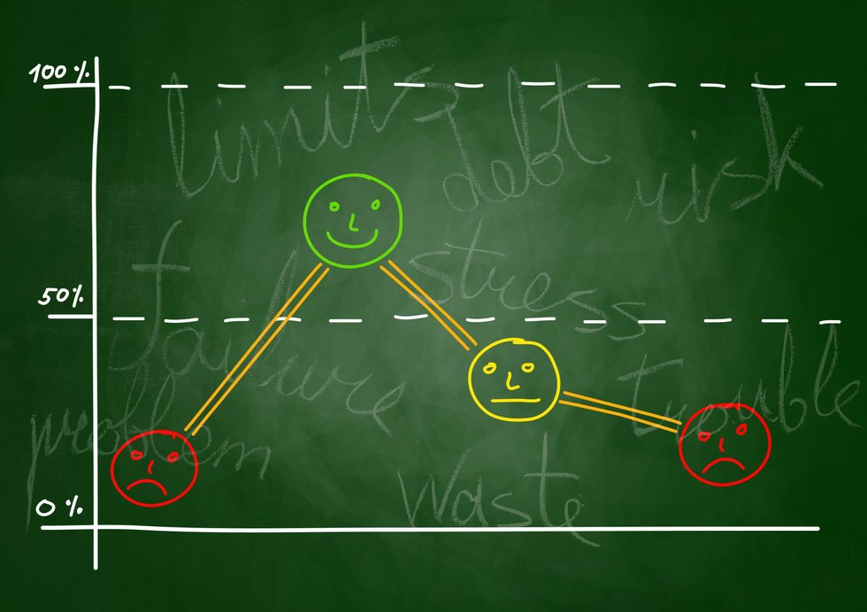

# Tales from the Crypto

## Background

There's been a lot of hype in the news lately about cryptocurrency, so you want to take stock, so to speak, of the latest news headlines regarding Bitcoin and Ethereum to get a better feel for the current public sentiment around each coin.

I applied natural language processing to understand the sentiment in the latest news articles featuring Bitcoin and Ethereum. I also applied fundamental NLP techniques to better understand the other factors involved with the coin prices such as common words and phrases and organizations and entities mentioned in the articles.

---

#### Sentiment Analysis

The [newsapi](https://newsapi.org/) was used to pull the latest news articles for Bitcoin and Ethereum.

#### Natural Language Processing

In this section, I used NLTK and Python to tokenize the text for each coin.

Next, I looked at the ngrams and word frequency for each coin.

Finally, I generated word clouds for each coin to summarize the news for each coin.

#### Named Entity Recognition

In this section, I built a named entity recognition model for both coins and visualized the tags using SpaCy.

---